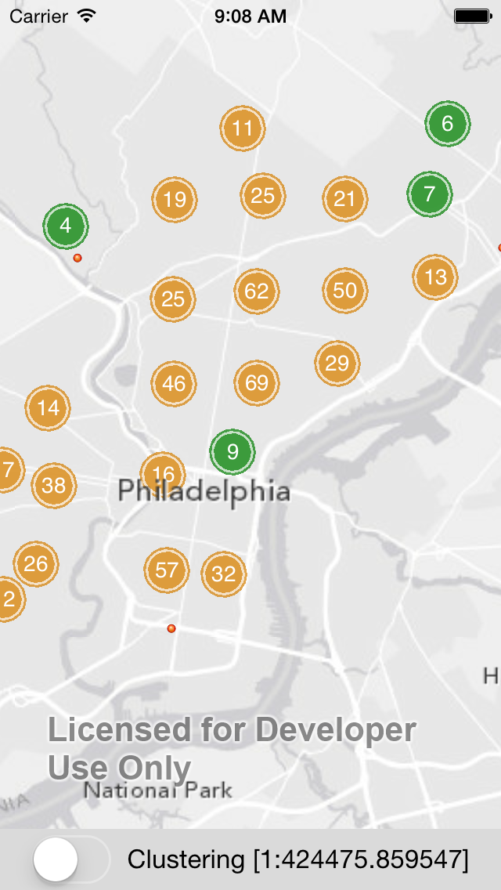

clusterlayer-plugin-ios
=======================

A cluster layer extension to the [ArcGIS Runtime for iOS](https://developers.arcgis.com/ios/).

The gridding code is based heavily on [Leaflet.markercluster](https://github.com/Leaflet/Leaflet.markercluster/blob/master/src/DistanceGrid.js)



## Usage
1. Import `AGSClusterLayer.h`
2. Add an `AGSFeatureLayer` to the `AGSMapView`
3. Create an `AGSClusterLayer` with the `AGSFeatureLayer` and add it to the `AGSMapView`
``` ObjC
#import "AGSClusterLayer.h"

#define kGreyBasemap @"http://services.arcgisonline.com/ArcGIS/rest/services/Canvas/World_Light_Gray_Base/MapServer"
#define kGreyBasemapRef @"http://services.arcgisonline.com/ArcGIS/rest/services/Canvas/World_Light_Gray_Reference/MapServer"

- (void)viewDidLoad
{
    [super viewDidLoad];

    [self.mapView addMapLayer:[AGSTiledMapServiceLayer tiledMapServiceLayerWithURL:[NSURL URLWithString:kGreyBasemap]]];

    AGSFeatureLayer *featureLayer = [AGSFeatureLayer featureServiceLayerWithURL:[NSURL URLWithString:kFeatureLayerURL] mode:AGSFeatureLayerModeOnDemand];
    [self.mapView addMapLayer:featureLayer];
    
    self.clusterLayer = [AGSClusterLayer clusterLayerForFeatureLayer:featureLayer];
    [self.mapView addMapLayer:self.clusterLayer];
}
```

You can also use an `AGSGraphicsLayer` to load data into a cluster layer, but you need to do this once the `AGSMapView` has loaded, for example in the `mapViewDidLoad:` delegate method of `AGSMapViewLayerDelegate`:

``` ObjC
-(void)mapViewDidLoad:(AGSMapView *)mapView {
    // Note, we need to add the GraphicsLayer after the AGSMapView has loaded so we know
    // there's a spatial reference we can use. You will see a warning in the console
    // logs if you don't.
    AGSGraphicsLayer *graphicsLayer = [AGSGraphicsLayer graphicsLayer];
    graphicsLayer.renderer = [AGSSimpleRenderer simpleRendererWithSymbol:self.symbol];
    [self.mapView addMapLayer:graphicsLayer];

    [graphicsLayer addGraphics:[self generateRandomPointGraphics:10000 inEnvelope:self.mapView.visibleAreaEnvelope]];

    // Now wrap it in an AGSClusterLayer. The original GraphicsLayer will be hidden in the map.
    self.graphicsClusterLayer = [AGSClusterLayer clusterLayerForGraphicsLayer:graphicsLayer];
    [self.mapView addMapLayer:self.graphicsClusterLayer];
}
```
